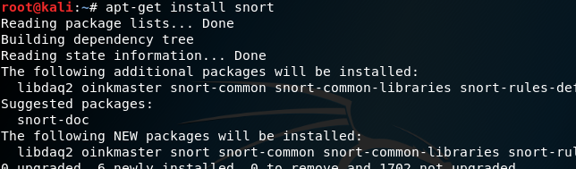
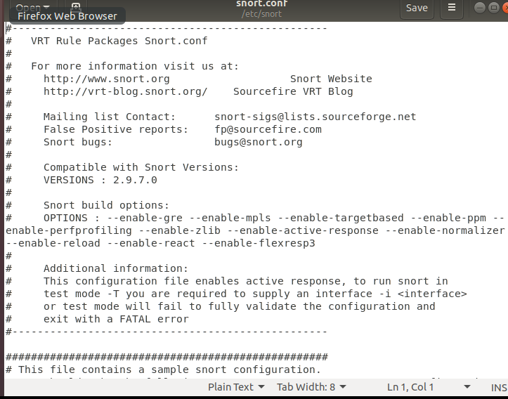
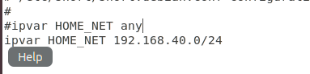
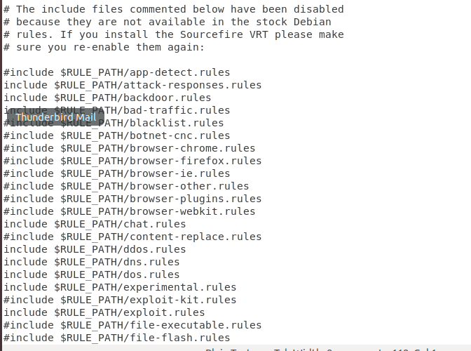
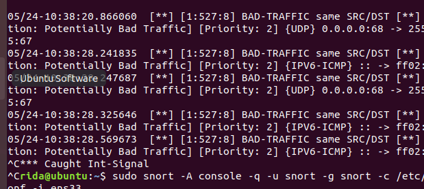
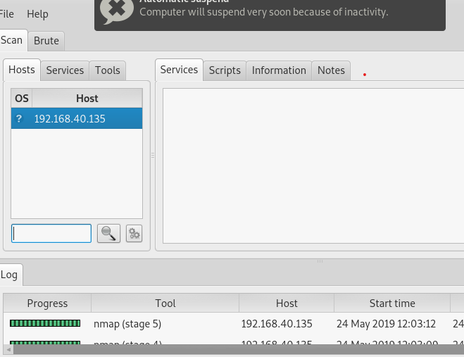
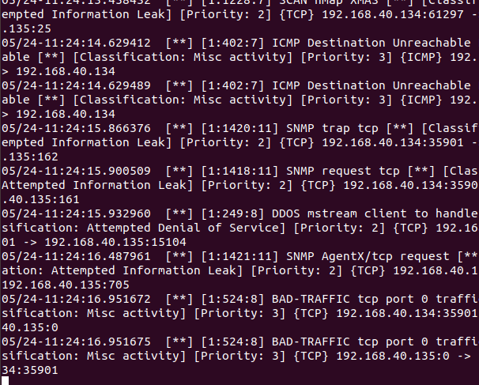

# DETECTION-D-INTRUSION-SNORT-

INTRODUCTION

 

L’ouverture des systèmes et leurs interconnexion avec le réseau Internet ont fait que les attaques soient de plus en plus nombreuses et diversifiées les unes que des autres. 
Outre la mise en place de par-feux et de systèmes d’authentification , il est de nos jours nécessaire de mettre en place un système de détection d’intrusion. 

## Snort :

Snort est un système de détection d'intrusion (ou NIDS) libre publié sous licence GNU GPL.
Snort est un système de détection d'intrusion sur réseau créé par Martin Roesch. 
Snort est un renifleur de paquets qui surveille le trafic réseau en temps réel, en examinant chaque paquet de près pour détecter une charge dangereuse ou des anomalies suspectes. 
Snort est basé sur libpcap (pour la capture de bibliothèque), un outil largement utilisé dans les analyseurs et les renifleuNrs de trafic TCP / IP. 
Grâce à l'analyse de protocole, à la recherche de contenu et à la correspondance, Snort détecte les méthodes d'attaque, notamment le déni de service, le dépassement de mémoire tampon, les attaques CGI, les analyses de port furtif et les problemes de SMB. Lorsqu'un comportement suspect est détecté, Snort envoie une alerte en temps réel à Syslog, à un fichier "d'alertes" séparé ou à une fenêtre contextuelle. Le groupe NSS, une organisation européenne de tests de sécurité des réseaux, a testé Snort ainsi que les produits de système de détection d'intrusion (IDS) de 15 fournisseurs majeurs, dont Cisco, Computer Associates et Symantec. 
SNORT permet d’analyser le trafic réseau de type IP, il peut être configuré

## fonctionner en trois modes : 

• le mode sniffer : dans ce mode, SNORT lit les paquets circulant sur le réseau et les affiche d’une façon continue sur l’écran ;

• Le mode « packet logger » : dans ce mode SNORT journalise le trafic réseau dans des répertoires sur le disque ; Mise en place d’une Sonde SNORT - 3 – 

• le mode détecteur d’intrusion réseau (NIDS) : dans ce mode, SNORT analyse le trafic du réseau, compare ce trafic à des règles déjà définies par l’utilisateur et établi des actions à exécuter ;

• le mode Prévention des intrusion réseau (IPS), c’est SNORT-inline.

## Les règles de SNORT :
sont composées de deux parties distinctes : le header et les options.

Le header permet de spécifier le type d’alerte à générer (alert, log et pass) et d’indiquer les champs de base nécessaires au filtrage : le protocole ainsi que les adresses IP et ports sources et destination. 

Les options, spécifiées entre parenthèses, permettent d’affiner l’analyse, en décomposant la signature en différentes valeurs à observer parmi certains champs du header ou parmi les données.

## Exemple de règle : 

Alert tcp any any -> 192.168.1.0/24 80 (flags :A ;\content : “passwd”; msg: “detection de passwd ;)
Cette règle permet de générer un message d’alerte “detection de passwd” lorsque le trafic à destination d’une machine du réseau local 192.168.1.0/24 vers le port 80, contient la chaîne « passwd » (spécifié par l’utilisation du mot-clé « content »), et que le flag ACK du header TCP est activé (flags : A).

## Installation :
Il faut installer les packege suivant avant d’utilisation de SNORT
LIBCAP 
Pcre 
Libnet 
BATNYARD 
DAQ

Apt-get install snort 
 
Ifconfig
 
Sudo gedit /etc/snort/snort.cong 
 
Pour spécifier l’adresse de réseau a analyser (any pour tout les reseau connecter au reseaux) :
 
Pour active les règle il faut enlever les commentaires sur la règle spécifique : 
 
Sudo snort -A console -q -u snort -g snort -c /etc/snort.conf -ens33
 

Machine attack (192.168.40.134 /24): 
Ataque nmap :
Nmap 192.168.40.135 

Autre ataque avec le PIRATA 1.0.3
 

Snort détecte les diffèrent types d’attaque : 
 
